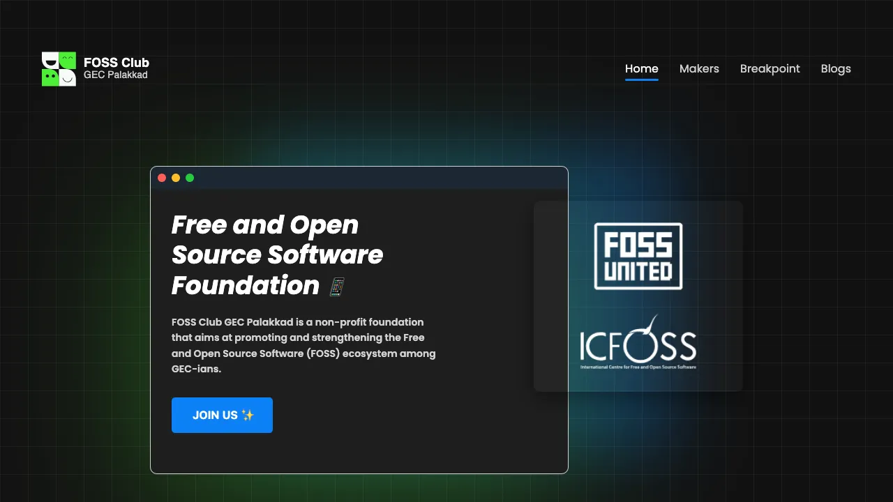

# FOSS Club GEC Palakkad: Official Website

<p align="center">

</p>

This repository contains the source code for the official website of the FOSS Clubs (Free and Open Source Software Clubs) at Government Engineering College, Palakkad. The website is built using Vue.js, a progressive JavaScript framework for building user interfaces.

## Table of Contents

- [Getting Started](#getting-started)
- [Contributing](#contributing)
- [Best Practices](#best-practices)
- [Code of Conduct](#code-of-conduct)
- [License](#license)

## Getting Started

To get a local copy of the project up and running, follow these steps:

1. Clone the repository:

   ```
   git clone https://github.com/FOSS-Cell-GECPKD/Website.git
   ```

2. Navigate to the project directory:

   ```
   cd Website
   ```

3. Install dependencies:

   ```
   npm install
   ```

4. Start the development server:

   ```
   npm run dev
   ```

   The website should now be running at `http://localhost:5173/`.

## Contributing

We welcome contributions from the community! If you'd like to contribute to this project, please follow these steps:

1. Fork the repository.
2. Create a new branch for your feature or bug fix:

   ```
   git checkout -b my-new-feature
   ```

3. Make your changes and commit them with descriptive commit messages.
4. Push your changes to your forked repository:

   ```
   git push origin my-new-feature
   ```

5. Create a new pull request against the `main` branch of the original repository.

Please refer to the [Contribution Guide](CONTRIBUTING.md) for more detailed instructions.

## Best Practices

To maintain a consistent and high-quality codebase, we follow these best practices:

- **Coding Style**: Follow the Vue.js Style Guide for consistent code formatting and naming conventions.
- **Components**: Modularize the UI into reusable Vue components.
- **State Management**: Use Vuex for managing the application state, if necessary.
- **Responsive Design**: Ensure the website is responsive and accessible across different devices and screen sizes.
- **Performance Optimization**: Optimize the website for better performance by following best practices like code splitting, lazy loading, and minification.

## Code of Conduct

We have adopted a Code of Conduct to ensure a welcoming and inclusive environment for all contributors. Please read and follow the [Code of Conduct](CODE_OF_CONDUCT.md).

## License

This project is licensed under the [MIT License](LICENSE).
